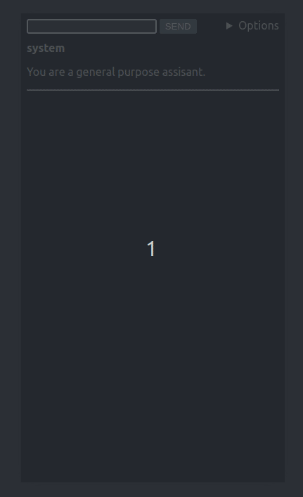

# xAI Chat

A simple chat interface for xAI's API.

## Usage

1. Go to [kakkoidev.github.io/xai-chat](https://kakkoidev.github.io/xai-chat)
2. Enter your xAI API key in the prompt
3. Start chatting

If you don't have an API key, you can get one from the [xAI console](https://console.x.ai/).

If you would like to user a different API key, you can do so by clicking the Options > UPDATE API KEY button.

⚠️ The API key and the chat history are stored in your browser's local storage.

## Features

- Markdown support: Messages are rendered as markdown.
- Cost display: The cost of each message is displayed.
- Auto-save: The chat is auto-saved to local storage, so you can come back to it later.
- Auto-scroll to bottom: The chat will automatically scroll to the bottom when a new message is received.
- Clear chat: The chat can be cleared by clicking the CLEAR CHAT button.
- Update system message: The system message (the message that is sent to the API to set the behavior of the chat) can be updated by clicking the UPDATE SYSTEM MESSAGE button.
- Update API key: The API key can be updated by clicking the UPDATE API KEY button.
- Toggle streaming: The streaming (the feature that allows the chat to be streamed in real-time) can be toggled by clicking the STREAMING button.
- Change temperature: Make the output more or less random by changing the temperature. 0 is the most deterministic, 2 is the most random.
